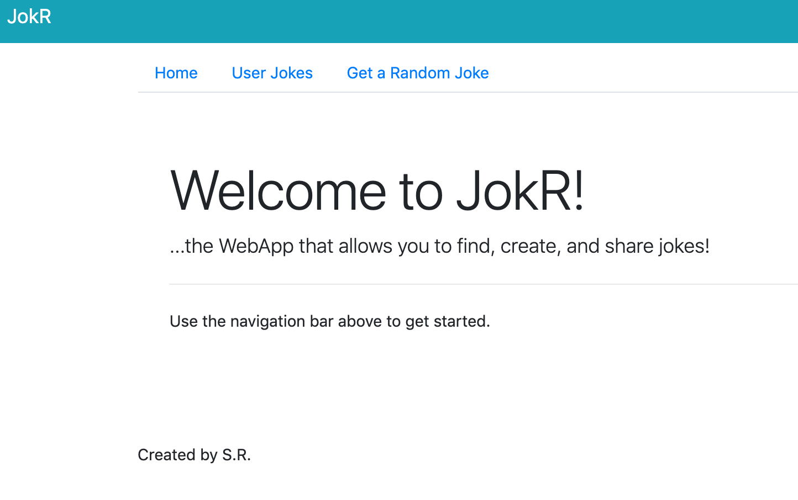
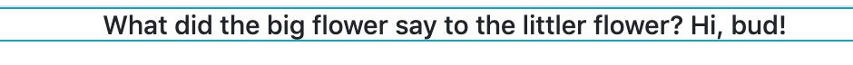

# Blog Client: Blog Application

This blog application allows users to read others' blog posts, author their own, and leave comments to further the discussion on their favorite posts.

## Important Links

- [API Repo](https://obscure-peak-32326.herokuapp.com/)
- [Deployed API](https://github.com/sr-hub/JokR-api/)
- [Deployed Client](https://sr-hub.github.io/JokR-front-end/#/)

## Planning Documents
- [Wireframes and User Stories (and ERDs)] (https://imgur.com/a/0QtmppG)

## Planning Process

### Technologies Used

- React
- HTML/CSS
- Bootstrap
- Javascript

### Unsolved Problems

- Styling
- Favorites
